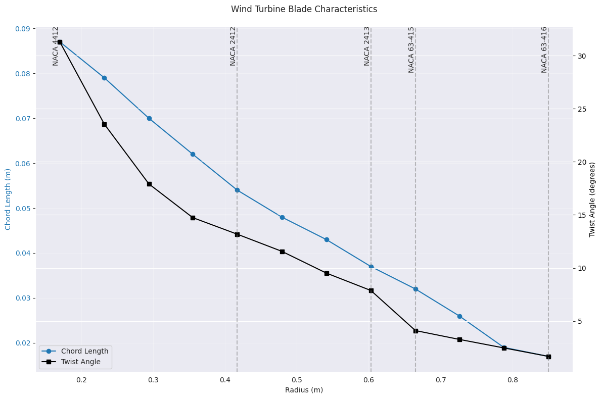
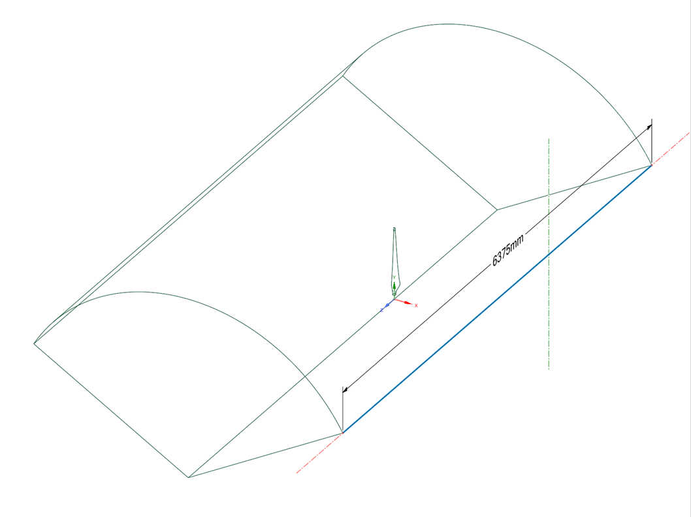
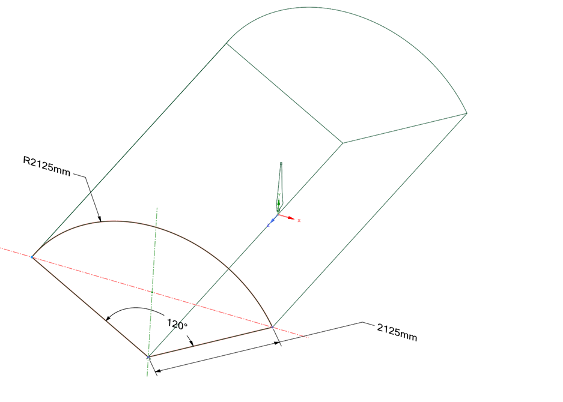
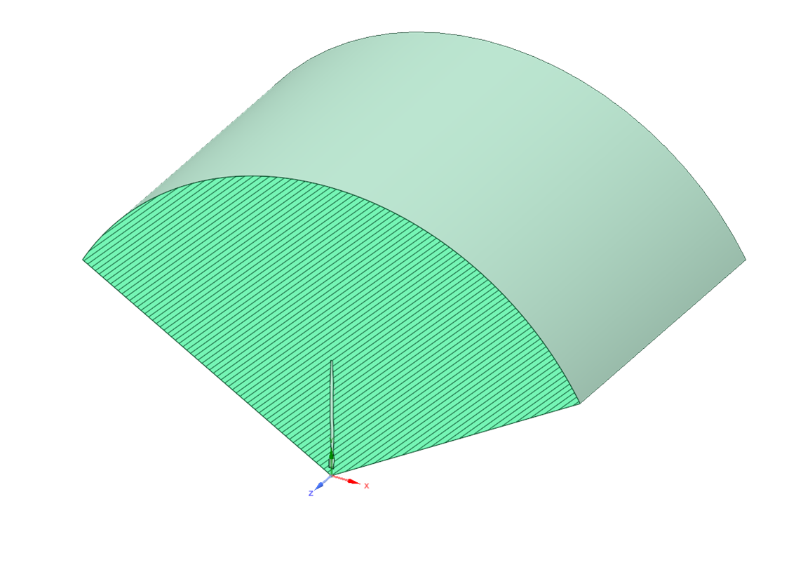
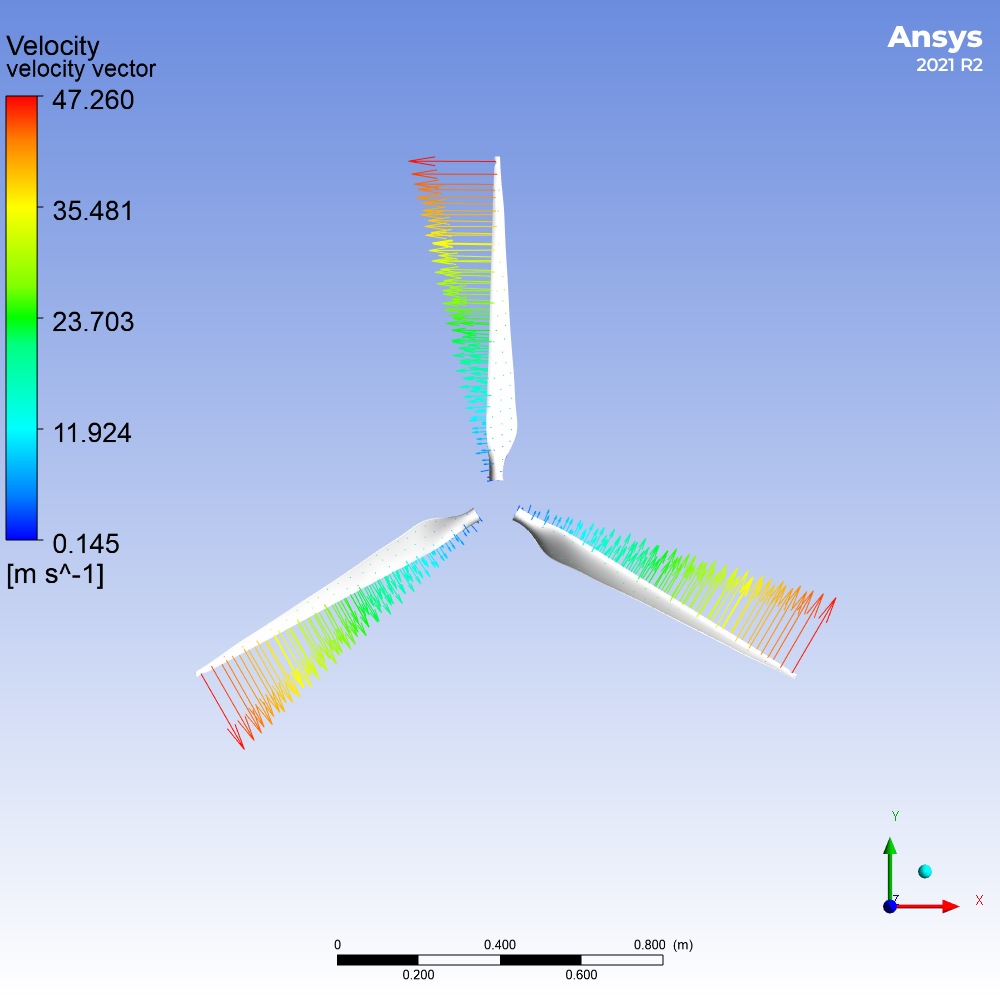
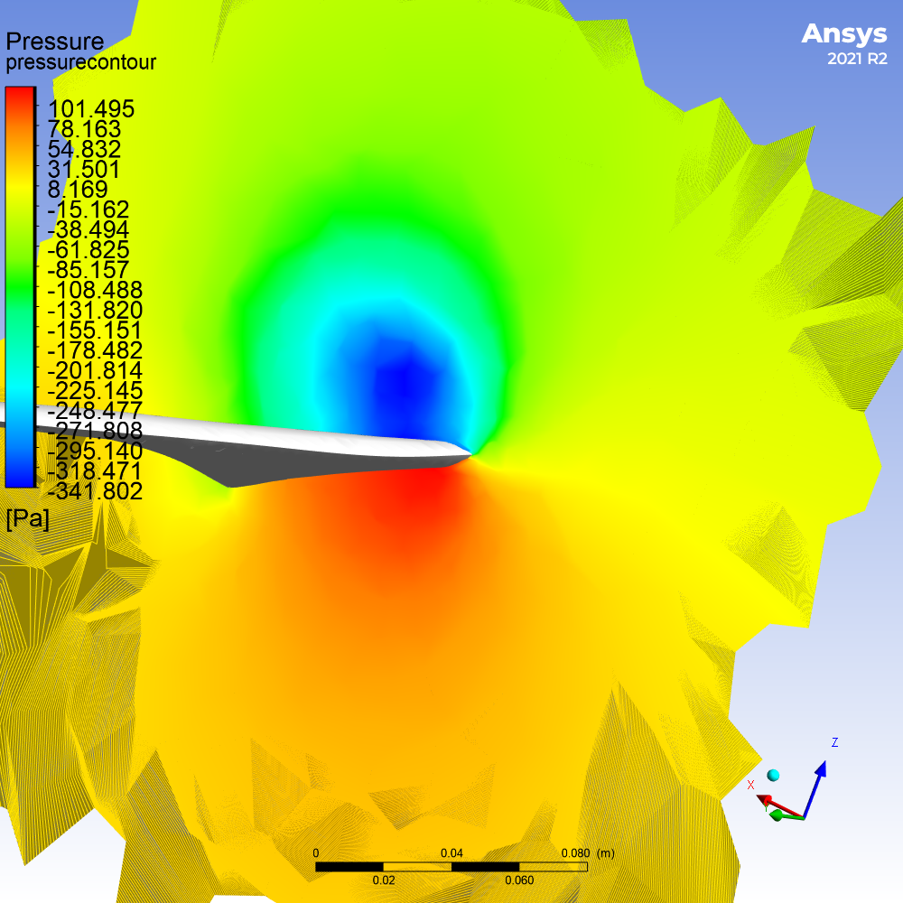

# Wind Turbine Blade Aerodynamic Study

## 1. Project Overview

### 1.1 Project Objectives
The primary goal of this project was to develop a comprehensive wind turbine blade design and analysis workflow, integrating:
- Theoretical aerodynamic design
- Computational modeling
- Computational Fluid Dynamics (CFD) simulation

### 1.2 Methodology Workflow
1. Theoretical Design Calculation
2. 3D Geometric Modeling
3. CFD Simulation and Analysis
4. Aerodynamic Performance Evaluation

## 2. Initial Design Parameters Calculation

### 2.1 Theoretical Approach
- **Method**: Blade Element Momentum (BEM) Theory
- **Implementation**: Custom [C++ code](https://github.com/Elshraby/BladeAeroStudy/blob/main/BEMtheory.cpp) code development
- **Key Calculations**:
  * Optimal chord length distribution
  * Blade twist angle optimization
  * Preliminary aerodynamic force predictions

### 2.2 Design Specifications

#### Wind Turbine Operational Parameters
| Parameter | Value | Unit |
|:----------|:-----:|:----:|
| Wind Speed | 12 | m/s |
| Rotor Speed | 625 | rpm |
| Tip Speed Ratio | 4.64 | - |
| Rotor Radius | 0.85 | m |

#### Airfoil Distribution
| Blade Section | Airfoil | Location |
|:------------:|:-------:|:--------:|
| Root | NACA 4412 | Inner section |
| Middle | NACA 2412 | Mid-radius |
| Tip | NACA 63-415 | Outer section |

**Rationale**: Varying airfoil profiles to optimize performance across different blade sections

### 2.3 Chord and Twist Distribution along the Blade

## 3. Computational Modeling

### 3.1 Geometric Modeling
- **Software**: SolidWorks
- **Modeling Approach**: Parametric 3D blade design
- **Key Considerations**:
  * Aerodynamic shape optimization
  * Structural integrity
  * Manufacturing feasibility

### 3.2 Computational Domain Setup
- **Software**: ANSYS Fluent
- **Domain Characteristics**:
  * Structured computational domain
  * Consideration of flow boundary conditions
  * Symmetry and periodic boundary treatments

### 3.3 Importing the geometry into Ansys Fluent and Setting the Domain

Dim Periodic             |  Dim Inlet               |  Sec View
:-------------------------:|:-------------------------:|:-------------------------:
  |    |  

### 3.4 Mesh Generation

- **Mesh Refinement Approach**:
  * Enhanced resolution near blade surface
  * Boundary layer capturing

- Mesh Metrics:

| Metric | Value |
|:------:|:-----:|
| Total Elements | 356,628 |
| Orthogonal Quality | 0.87 |
| Skewness | 0.21 |

### 3.5 Numerical Solution

Solver settings:
- **Solver Type**: Pressure-based coupled solver
- **Turbulence Model**: k-ω SST
- **Discretization**: Second-order upwind spatial discretization
- **Convergence Criteria**: 10^-6

## 4. Numerical Results.
The results from the CFD analysis provided insights into:

Pressure Distribution: Over the blade surface.
Velocity Field: Around the blade.
Aerodynamic Forces: Lift and drag forces quantified.

Velocity Field around the Blade             |  Pressure Distribution near the Root
:-------------------------:|:-------------------------:
  |  
